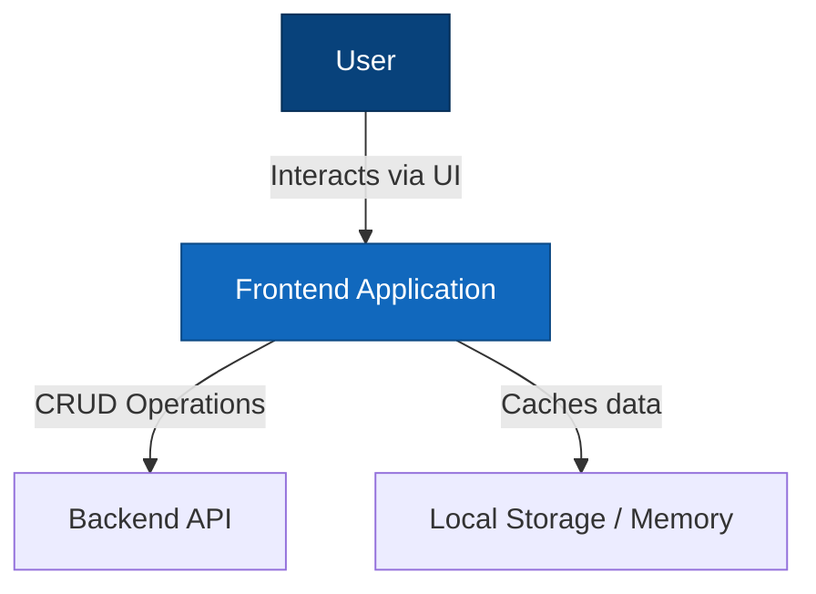

# Sport-Sync - Frontend

A SvelteKit-based frontend for managing Sport-Sync, competitions, teams, players, and games. Built with TypeScript and Tailwind CSS, following Hexagonal Architecture (Ports and Adapters pattern) for clean separation of concerns and testability.

## The Problem

Managing Sport-Sync involves complex workflows: registering teams, managing player rosters, scheduling fixtures, recording live game events, and tracking standings. Traditional implementations often result in:

- Duplicated CRUD code for each entity
- Tightly coupled components that are hard to test
- Inconsistent UI patterns across different modules
- Difficulty adapting to different data sources (memory, API, database)

## The Solution

This frontend provides:

- **Generalized CRUD System**: Single implementation handles all entities via metadata
- **Hexagonal Architecture**: Core logic isolated from external dependencies
- **Mobile-First Design**: Responsive layouts optimized for all screen sizes
- **Type-Safe Development**: Full TypeScript support with validation
- **Dependency Injection**: All dependencies injected for easy testing and swapping

## Architecture

This application follows **Hexagonal Architecture** (Ports and Adapters pattern) to maintain clean separation between business logic and external dependencies.

### C4 Model - System Context



### Key Architectural Patterns

**Hexagonal Architecture Benefits**:

- **Testability**: Core logic isolated from external dependencies, enabling comprehensive unit testing with mocks
- **Flexibility**: Easy to swap implementations (e.g., replace InMemory repository with Supabase)
- **Maintainability**: Clear boundaries between business logic and infrastructure concerns

**Our Port Structure**:

All port interfaces live in `core/interfaces/ports/` and are organized by direction:

- **Internal Ports** (`ports/internal/usecases/`) - Interfaces the UI calls into the core
  - `PlayerUseCasesPort`, `TeamUseCasesPort`, `FixtureUseCasesPort`, etc.
  - These define CRUD operations and business logic the presentation layer can invoke

- **External Ports** (`ports/external/`) - Interfaces the core depends on for external services
  - `repositories/` - Data access interfaces (`PlayerRepository`, `TeamRepository`, etc.)
  - `iam/` - Identity & Access Management interfaces (`AuthenticationPort`, `AuthorizationPort`)

**Adapters** (implemented in `adapters/`):

- `repositories/` - InMemory implementations of repository interfaces
- `iam/` - Local authentication and role-based authorization
- `persistence/` - Service adapters for data persistence
- `initialization/` - Seeding and data reset utilities

**Layer Responsibilities**:

| Layer              | Purpose                                                             |
| ------------------ | ------------------------------------------------------------------- |
| **Core**           | Business logic, entities, use cases, domain services                |
| **Ports**          | Interface contracts (internal use cases, external repositories/IAM) |
| **Adapters**       | Concrete implementations of port interfaces                         |
| **Presentation**   | UI components, Svelte stores, page routes                           |
| **Infrastructure** | DI container, metadata registries, utilities                        |

**Dependency Injection**: All external dependencies injected via `UseCasesContainer` and `RepositoryContainer` for runtime flexibility and testability.

## Project Structure

```
src/lib/
├── core/                              # CORE DOMAIN LAYER
│   │                                  # Pure business logic, no external dependencies
│   │
│   ├── entities/                      # Domain entities and value objects
│   │   ├── BaseEntity.ts              # Base entity with id, timestamps
│   │   ├── Player.ts                  # Player entity with validation
│   │   ├── Team.ts                    # Team entity
│   │   ├── Competition.ts             # Competition entity
│   │   ├── Fixture.ts                 # Game/fixture entity with events
│   │   └── ...                        # 20+ domain entities
│   │
│   ├── interfaces/                    # Port interfaces (TypeScript interfaces)
│   │   └── ports/
│   │       ├── internal/              # Interfaces UI calls INTO the core
│   │       │   └── usecases/          # Use case port interfaces
│   │       │       ├── BaseUseCasesPort.ts
│   │       │       ├── PlayerUseCasesPort.ts
│   │       │       └── ...            # 30+ entity use case ports
│   │       └── external/              # Interfaces core DEPENDS ON
│   │           ├── repositories/      # Data access interfaces
│   │           │   ├── Repository.ts  # Base repository interface
│   │           │   ├── PlayerRepository.ts
│   │           │   └── ...            # 30+ entity repository interfaces
│   │           └── iam/               # Identity & access interfaces
│   │               ├── AuthenticationPort.ts
│   │               └── AuthorizationPort.ts
│   │
│   ├── usecases/                      # Use case implementations
│   │   ├── BaseUseCases.ts            # Base use case types
│   │   ├── PlayerUseCases.ts          # Player business logic
│   │   ├── FixtureUseCases.ts         # Fixture operations with game events
│   │   └── ...                        # All entity use cases
│   │
│   ├── services/                      # Domain services
│   │   ├── fixtureLineupWizard.ts     # Lineup submission workflow
│   │   ├── teamPlayers.ts             # Team roster operations
│   │   └── WorkflowStateMachine.ts    # State machine for workflows
│   │
│   └── types/                         # Shared types and value objects
│       ├── Result.ts                  # Result<T, E> type for error handling
│       └── SubEntityFilter.ts         # Filter types
│
├── adapters/                          # ADAPTERS LAYER
│   │                                  # Concrete implementations of port interfaces
│   │
│   ├── repositories/                  # Repository implementations
│   │   ├── InMemoryBaseRepository.ts  # Generic in-memory storage
│   │   ├── InMemoryPlayerRepository.ts
│   │   └── ...                        # All entity repository implementations
│   │
│   ├── iam/                           # Identity & Access Management adapters
│   │   ├── LocalAuthorizationAdapter.ts  # Role-based authorization
│   │   └── LocalAuthenticationAdapter.ts # Local auth for development
│   │
│   ├── persistence/                   # Data persistence adapters
│   │   ├── sportService.ts            # Sport data persistence
│   │   └── officialService.ts         # Official data persistence
│   │
│   └── initialization/                # App initialization adapters
│       ├── seedingService.ts          # Test data generation
│       └── dataResetService.ts        # Data reset utilities
│
├── presentation/                      # PRESENTATION LAYER
│   │                                  # UI components and page logic
│   │
│   ├── components/                    # Svelte components
│   │   ├── DynamicEntityForm.svelte   # Auto-generated CRUD forms
│   │   ├── DynamicEntityList.svelte   # Auto-generated entity lists
│   │   ├── EntityCrudWrapper.svelte   # Combined CRUD interface
│   │   ├── UiWizardStepper.svelte     # Multi-step workflow wizard
│   │   ├── LiveGameManagement.svelte  # Real-time game interface
│   │   ├── ui/                        # Reusable UI primitives
│   │   ├── layout/                    # Layout components
│   │   └── theme/                     # Theme components
│   │
│   └── stores/                        # Svelte stores
│       ├── branding.ts                # Organization branding state
│       ├── theme.ts                   # Theme configuration
│       └── memoryStore.ts             # In-memory data store
│
└── infrastructure/                    # INFRASTRUCTURE LAYER
    │                                  # Cross-cutting utilities
    │
    ├── container.ts                   # Dependency injection container
    ├── registry/                      # Metadata registries
    │   ├── EntityMetadataRegistry.ts  # Entity field definitions
    │   └── entityUseCasesRegistry.ts  # Use case factory registry
    └── utils/                         # Utilities
        ├── countries.ts               # Country data
        ├── FakeDataGenerator.ts       # Test data factory
        └── SeedDataGenerator.ts       # Seed data generation
```

### Architecture Quick Reference

| Layer              | Purpose                 | Dependencies    | Example                             |
| ------------------ | ----------------------- | --------------- | ----------------------------------- |
| **Core**           | Business logic & rules  | None (pure TS)  | Validating players, fixture scoring |
| **Ports**          | Interface contracts     | Core entities   | UseCasesPort, Repository interfaces |
| **Adapters**       | Port implementations    | Port interfaces | InMemory storage, auth adapters     |
| **Presentation**   | User interface          | Use case ports  | CRUD forms, game management UI      |
| **Infrastructure** | Cross-cutting utilities | None            | DI container, metadata registries   |

### Data Flow

```
[User Input] → Presentation → UseCases (internal port) → Repository (external port) → [Storage]
                    ↓                    ↓
              Svelte Stores       Domain Services
                    ↓
              [UI Updates]
```

## Generalized CRUD System

Instead of separate CRUD implementations for each entity, this system automatically adapts based on entity metadata.

### Core Components

1. **EntityMetadataRegistry** - Centralized metadata definitions for all entities
2. **DynamicEntityForm** - Auto-generates forms based on entity metadata
3. **DynamicEntityList** - Auto-generates lists with CRUD operations
4. **EntityCrudWrapper** - Combines form and list for complete entity management

### Adding a New Entity

```typescript
// 1. Define entity in core/entities/NewEntity.ts
export interface NewEntity extends BaseEntity {
  name: string;
  status: "active" | "inactive";
}

// 2. Register metadata in EntityMetadataRegistry
this.metadata_map.set("new_entity", {
  entity_name: "new_entity",
  display_name: "New Entity",
  fields: [
    {
      field_name: "name",
      display_name: "Name",
      field_type: "string",
      is_required: true,
      show_in_list: true,
    },
    {
      field_name: "status",
      display_name: "Status",
      field_type: "enum",
      enum_options: [
        { value: "active", label: "Active" },
        { value: "inactive", label: "Inactive" },
      ],
      is_required: true,
    },
  ],
});

// 3. Create port interface in core/interfaces/ports/
export interface NewEntityUseCasesPort extends BaseUseCasesPort<...> {}

// 4. Create adapter interface in core/interfaces/adapters/
export interface NewEntityRepository extends Repository<...> {}

// 5. Implement repository in adapters/repositories/
// 6. Implement use case in core/usecases/
```

### Field Types Supported

- **string** - Text input or textarea
- **number** - Number input with validation
- **boolean** - Checkbox
- **date** - Date picker
- **enum** - Dropdown with predefined options
- **foreign_key** - Dropdown populated from related entities

### Usage Example

```svelte
<EntityCrudWrapper
  entity_type="organization"
  initial_view="list"
  is_mobile_view={true}
  on:entity_created={handle_created}
  on:entity_updated={handle_updated}
  on:entity_deleted={handle_deleted}
/>
```

## Zero Trust Security

The application implements a **Zero Trust security model** where every request is verified regardless of origin. Nothing is implicitly trusted.

### Core Principles

| Principle                 | Implementation                                                   |
| ------------------------- | ---------------------------------------------------------------- |
| **Never Trust**           | Every action requires token validation before execution          |
| **Always Verify**         | Authorization checked on every CRUD operation, not just login    |
| **Least Privilege**       | Users only get permissions needed for their specific role        |
| **Explicit Verification** | UI buttons hidden AND backend checks prevent unauthorized access |
| **Micro-segmentation**    | Data partitioned by organization, team, and individual scope     |

### Token-Based Verification

Every operation validates the JWT token:

```typescript
interface AuthTokenPayload {
  user_id: string;
  email: string;
  display_name: string;
  role: UserRole;
  organization_id: string;
  team_id: string;
  issued_at: number;
  expires_at: number;
}
```

Token failures are explicit:

- `token_invalid` - Token signature or structure invalid
- `token_expired` - Token past expiration time
- `permission_denied` - Valid token but insufficient permissions

### Per-Request Authorization

Unlike session-based systems, authorization is checked on EVERY operation:

1. **Route access** - `can_profile_access_route(token, route)` validates navigation
2. **Entity CRUD** - `check_entity_authorized(token, entity_type, action)` validates operations
3. **Data scope** - `build_authorization_list_filter(token, entity_type)` restricts query results

### Defense in Depth

Security is enforced at multiple layers:

```
Layer 1: Route Guard     → Blocks unauthorized page access
Layer 2: UI Enforcement  → Hides buttons user can't use
Layer 3: Action Check    → Validates permission before API call
Layer 4: Data Filtering  → Restricts query results to authorized scope
```

### Scope Isolation

Users are isolated to their authorized data scope:

- **Organization scope**: org_admin sees only their organization's data
- **Team scope**: team_manager sees only their team's players/staff
- **Individual scope**: players/officials see only their own records

The `UserScopeProfile` enforces these boundaries:

```typescript
interface UserScopeProfile {
  organization_id: string; // Organization boundary
  team_id: string; // Team boundary
  player_id?: string; // Individual boundary (players)
  official_id?: string; // Individual boundary (officials)
}
```

## Authorization System

The application implements a comprehensive role-based access control (RBAC) system that controls both navigation and CRUD operations.

### User Roles

| Role                  | Description                           | Typical User               |
| --------------------- | ------------------------------------- | -------------------------- |
| **super_admin**       | Full system access                    | System administrator       |
| **org_admin**         | Full organization access              | Organization administrator |
| **officials_manager** | Manages officials within organization | Officials coordinator      |
| **team_manager**      | Manages team, staff, and players      | Team coach/manager         |
| **official**          | View-only with self-profile edit      | Referee/umpire             |
| **player**            | View-only with self-profile edit      | Athlete                    |

### Data Categories

Entities are grouped into permission categories that determine access levels:

| Category                    | Description                 | Example Entities                      |
| --------------------------- | --------------------------- | ------------------------------------- |
| **root_level**              | System-wide reference data  | Sport, Gender, CompetitionFormat      |
| **org_administrator_level** | Organization admin settings | SystemUser, AuditLog, Settings        |
| **organisation_level**      | Organization-owned data     | Competition, Official, Venue, Fixture |
| **team_level**              | Team-specific data          | Team, TeamStaff, FixtureLineup        |
| **player_level**            | Player-specific data        | Player, PlayerProfile, Qualification  |

### Permission Matrix

Each role has CRUD permissions per category:

```
                    root_level   org_admin_level   organisation_level   team_level   player_level
super_admin         CRUD         CRUD              CRUD                 CRUD         CRUD
org_admin           R---         CRUD              CRUD                 CRUD         CRUD
officials_manager   R---         ----              -RU-                 R---         R---
team_manager        R---         ----              R---                 -RU-         -RU-
official            R---         ----              -RU-                 R---         R---
player              R---         ----              R---                 R---         -RU-

Legend: C=Create, R=Read, U=Update, D=Delete, -=No access
```

### Role-Based Sidebar Menus

Each role sees a customized sidebar menu:

- **super_admin/org_admin**: Full access to all management sections
- **team_manager**: "My Team", "My Team Profile", "My Team Staff", "My Players"
- **official**: "My Official Profile", Live Games, Calendar
- **player**: "My Profile", "My Team Memberships", Calendar

### UI Authorization Enforcement

The `EntityCrudWrapper` and `DynamicEntityList` components automatically:

1. **Hide buttons** based on permissions (Create, Edit, Delete)
2. **Show info banners** when access is restricted
3. **Filter data** to only show relevant records (e.g., player sees only their profile)

```typescript
// Example: Check if user can edit entity
const can_edit = await authorization_adapter.check_entity_authorized(
  token,
  "team",
  "update",
);
```

### Scope-Based Data Filtering

Users with restricted scopes only see data they're authorized to access:

| Role         | Scope Restriction                         |
| ------------ | ----------------------------------------- |
| team_manager | `team_id` - Only see their team's data    |
| official     | `official_id` - Only see their own record |
| player       | `player_id` - Only see their own record   |

## Getting Started

### Prerequisites

- Node.js 18+
- npm or pnpm

### Installation

```bash
cd frontend
npm install
```

### Development Server

```bash
npm run dev
```

The application will be available at `http://localhost:5173`

### Type Checking

```bash
npm run check
```

### Testing

```bash
# Run all tests
npm test

# Run tests in watch mode
npm run test:watch

# Run with coverage
npm run test:coverage
```

### Building

```bash
npm run build
```

### Preview Production Build

```bash
npm run preview
```

## Testing

The project uses Vitest for unit testing with comprehensive coverage:

```bash
# Run all tests
npm test

# Run specific test file
npm test src/lib/core/entities/Player.test.ts

# Run with verbose output
npm test -- --reporter=verbose
```

### Test Organization

Tests are co-located with source code:

- `Player.test.ts` - Player entity validation tests
- `teamPlayers.test.ts` - Team roster operations tests
- `fixtureLineupWizard.test.ts` - Lineup workflow tests
- `searchable_select_logic.test.ts` - UI component logic tests

### Mocking Dependencies

For unit testing, inject mock use cases:

```typescript
import { inject_test_use_cases_container } from "$lib/infrastructure/container";

const mock_player_use_cases: PlayerUseCasesPort = {
  create: vi.fn(),
  get_by_id: vi.fn(),
  list: vi.fn(),
  update: vi.fn(),
  delete: vi.fn(),
};

inject_test_use_cases_container({
  player_use_cases: mock_player_use_cases,
  // ... other mocked use cases
});
```

## Key Design Principles

1. **Mobile-First** - All components prioritize mobile experience
2. **Stateless Functions** - Helpers take parameters and return values
3. **Explicit Return Types** - All functions have clear return types
4. **Long Descriptive Names** - Variables and methods clearly named
5. **No Nested IFs** - Flat conditional logic with early returns
6. **Modular Files** - Each file under 200 lines when possible
7. **Debug Logging** - Comprehensive logging for troubleshooting
8. **Test-Driven** - Write tests first, then implementation
9. **No Comments** - Self-documenting code with clear names
10. **Result Types** - Explicit success/failure handling

## Technology Stack

- **Framework**: SvelteKit 2.x with Svelte 5
- **Language**: TypeScript
- **Styling**: Tailwind CSS
- **Build Tool**: Vite
- **Testing**: Vitest
- **State**: Svelte Stores
- **Architecture**: Hexagonal (Ports and Adapters)

## Core Features

### Implemented

- ✅ Organization management (CRUD)
- ✅ Competition management
- ✅ Team management with rosters
- ✅ Player management with positions
- ✅ Fixture scheduling and management
- ✅ Live game event recording
- ✅ Lineup submission workflow
- ✅ Official assignment
- ✅ Generalized CRUD system
- ✅ Mobile-responsive design
- ✅ Theme customization
- ✅ Role-based authorization (RBAC)
- ✅ Scope-based data filtering
- ✅ Competition standings and brackets
- ✅ Player statistics and analytics
- ✅ Notification system
- ✅ Export/import functionality
- ✅ PWA offline support
- ✅ Real-time WebSocket updates for Live Games
- ✅ Authentication with Clerk


## Contributing

The hexagonal architecture makes it easy to:

- **Add new entities**: Define entity, create port/adapter interfaces, implement
- **Add new storage backends**: Implement adapter interfaces (e.g., Supabase, Firebase)
- **Add new UI components**: Work in presentation layer without touching core
- **Add new workflows**: Create domain services in core

All business logic changes should go in `core/` with corresponding unit tests.

## Related Documentation

- [Main Project README](../README.md)
